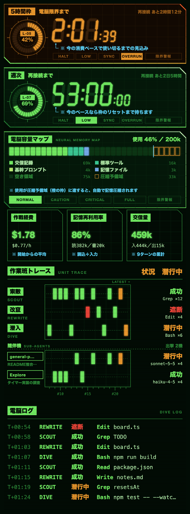
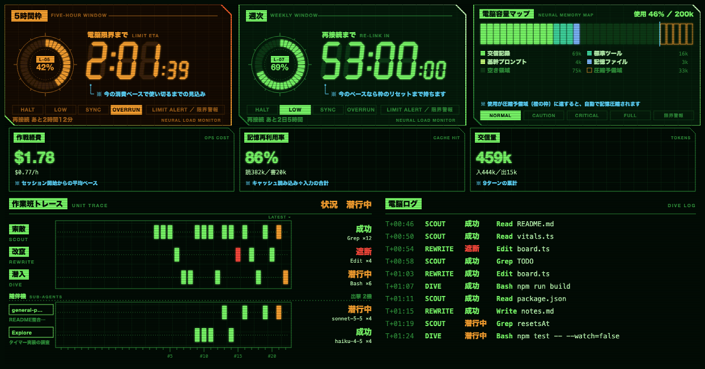

# netdive-quota

Claude Codeのサイドパネルに、燐光グリーンの電脳モニターを出すプラグインです。[jnk0vc/quota-reactor](https://github.com/jnk0vc/quota-reactor)から表示する情報とロジックを受け継ぎ、画面の構成と言葉づかいは一から作り直しています。



パネルの幅が広いときは、タイマー3基ぶんを横に並べ、作業班トレースの右に電脳ログを置きます。



## 表示内容

**上段のタイマーと電脳容量マップ**

- 5時間枠と週次の利用枠を、扇形セグメントのリングゲージと7セグメントの数え下ろしで表示します。報告された利用枠を最大3基まで並べます。
- リングは36区画で残量を示し、中央に回線番号を反転表示します。`L-05`は5時間枠、`L-07`は週次です。`L-07F`のように末尾に頭文字が付くものはモデル別の週次です。
- 段階は`HALT`・`LOW`・`SYNC`・`OVERRUN`の4つです。
  - `OVERRUN`: 今のペースだとリセット前に使い切る見込みなので、使い切るまでの時間を数えます（`電脳限界まで`）。
  - `SYNC` / `LOW`: リセットまで持つので、リセットまでの時間を数えます（`再接続まで`）。`LOW`は経過時間の割に使用量が半分未満のときです。
  - `HALT`: 使い切った状態で、`0:00`が点滅します。
- `OVERRUN`かどうかは、枠が始まってからの経過時間と使用率から、同じペースで使い続けたときに100%に達する時刻を見積もって決めます。その時刻がリセットより前なら`OVERRUN`です。経過が1分未満のときと、使用率が0%のときは見積もらず、リセットまでの時間を数えます。
- 数値の下には、その数値が何を数えているかの注釈をシアンの引き出し線で添えます。
- タイマーの色は、残量（100% − 使用率）と使い切る見込みで変わります。上から順に判定し、最初に当てはまった色になります。

  | 色 | 条件 |
  |---|---|
  | 赤 | 残量が20%未満（使用率80%超）、使い切った（`HALT`）、`OVERRUN`で使い切るまで30分を切った、使用率90%以上、のどれか |
  | 橙 | 残量が50%以下（使用率50%以上）か、`OVERRUN` |
  | 緑 | 上のどれにも当たらないとき |

  境界は、残量ちょうど50%で橙、ちょうど20%ではまだ橙です。
- 右下の`LIMIT ALERT ／ 限界警報`ランプは、使い切った、`OVERRUN`で使い切るまで30分を切った、使用率90%以上、のどれかで点滅します。
- 使用率が90%以上の枠があると、入力欄の上に赤い`電脳限界接近`の帯が出ます（下の「入力欄の上の帯」を参照）。
- `電脳容量マップ`: コンテキストの使用率と内訳（交信記録、標準ツール、記憶ファイルなど）を区画の帯で示します。週次タイマーの下に置き、横幅が広いときは空いた3基目の位置に置きます。
  - 橙の枠の`圧縮予備域`に達すると、自動で記憶圧縮されます。
  - 最下段のランプで段階を示します。使用60%未満が`NORMAL`、80%未満が`CAUTION`、95%未満が`CRITICAL`、それ以上が`FULL`です。
  - 枠の色はタイマーと同じ基準で、使用率50%未満は緑、50%以上は橙、80%以上は赤です。80%以上では`限界警報`ランプも点滅します。
  - 内訳は`/context`と同じ見積もりを、トークン数の計算リクエストを送らない方式で、応答のたびに取り直します。内訳が取れないうちは、使用量だけで描きます。

**計器（電脳容量マップの下）**

- `作戦経費`: セッションの累計コスト（USD）と、開始からの1時間あたりの平均ペースです。開始から5分たつまではペースを出しません。
- `記憶再利用率`: 入力トークンのうち、プロンプトキャッシュから読み込んだ割合です。全ターン（サブエージェントを含む）の累計で計算します。
- `交信量`: 入力と出力のトークンの累計と、ターン数です。

**作業班トレースと電脳ログ**

- ツールの実行を3つの班が受け持ちます。`索敵 SCOUT`はRead・Grep・Globなどの読み取り、`改竄 REWRITE`はEdit・Write・NotebookEditの書き換え、`潜入 DIVE`はBashとそれ以外の実行です。
- 3班を横長のレーンに並べ、1回の実行を1列として打刻します。右端が最新です。結果に応じて、`成功`は緑、`遮断`は赤、実行中の`潜行中`は橙の点滅で表示します。列の下には通し番号の目盛りを振ります。
- その下の`随伴機 SUB-AGENTS`には、サブエージェントを1機1レーンで並べます。種類・作業内容・モデル・実行回数を表示し、その機体が行った実行を班のレーンと同じ列に重ねて打刻します。実行中の機体を優先して、最大3機まで出します。
- 電脳ログには、経過時間・担当・結果・ツール・対象を等幅で1行ずつ記録します。

**入力欄の上の帯**

- Bashの実行中は、橙で`潜入中 DIVE`とコマンドを表示します。
- ツールが失敗すると、赤で`遮断 BLOCKED`と理由を表示します。`確認`で消せます。
- 利用枠の使用率が90%を超えると、赤で`電脳限界接近`を表示します。
- Claudeの作業中は、緑で`電脳接続中 ONLINE`を表示します。

## 使い方

Claude Codeで次の2つを実行してインストールします。

```
/plugin marketplace add jnk0vc/netdive-quota
/plugin install netdive-quota@netdive-quota
```

パネルは幅が足りるときに自動で開きます。`/netdive`でいつでも開けます。

## 動作条件

- 関数フックのプラグイン（早期アクセス機能）に対応したClaude Codeが必要です。2.1.286で動作を確認しています。
- この機能が既定でオフの版では、`CLAUDE_CODE_ENABLE_FUNCTION_HOOKS=1`を付けて起動してください。
- デスクトップのCodeタブはSVGで計器盤を描きます。ターミナルでは同じ内容を緑の文字で並べます。
- 利用枠のタイマーにはClaudeのサブスクリプションが必要です。ない場合は電脳容量マップだけが出ます。

## デザインについて

- 90年代の日本のサイバーパンク作品に見られるモニター表現を参考にしています。参考にしたのは、燐光グリーン単色のCRT画面、走査線、扇形セグメントのリングゲージ、反転表示のラベル箱、太い大文字の見出し、精密な技術図解の欄外注釈、横長のパノラマHUDといった一般的な表現手法です。図案・ロゴ・キャラクター・作品固有の用語は使っていません。
- 日本語はヒラギノ角ゴシック（ない場合は游ゴシック、Noto Sans JP）、英字の見出しはHelvetica Neue、ログは等幅フォントで描きます。フォントは同梱していません。
- 特定の作品・権利者とは関係ありません。

## License

[MIT](LICENSE)。元になった[quota-reactor](https://github.com/jnk0vc/quota-reactor)の著作権表示を含みます。
